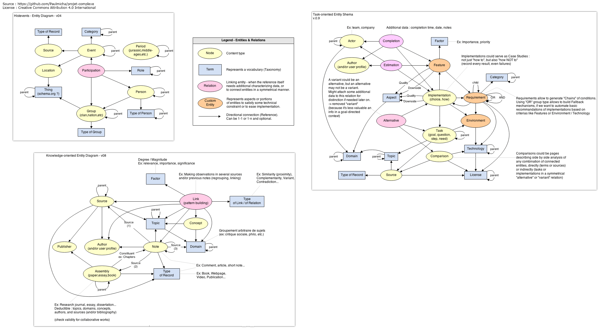

# Projet complexe

## TL;DR

*"All [curation](https://twitter.com/plevy/status/716299155904311297) grows until it requires search. All search grows until it requires curation"* – [B. Evans](http://ben-evans.com/benedictevans/2016/1/31/lists-are-the-new-search)

This project gathers old ideas about an open-source web application for taking notes. Its functions / current objectives are :
* Research journal on very diverse subjects (personal archive)
* Private, public, multi-user with optional open access for collaboration, inspiration, discourse
* Organizing notes (relations, knowledge management, "archeology of knowledge", reflexivity) - including experimenting with automation (e.g. producing suggestions or generating relations) and mixing different indexes
* Data import/export - including periodically and automatically,  and visualization
* Efficient interface design aiming for accessibility, progressive enhancement, and offline capabilities (+ installable app ?)

## General presentation

### Conception

Between 2009 and 2014, I started several projects which are now integrated into a single one ("projet complexe"). One started out of curiosity for History and interactive visualization of historical events, another focused on the findability of "memo" notes about practical knowledge (consisting in a collection and archive of instructions, guides and tutorials), and the last one was centered around the organization of notes, concepts and knowledge (their origins and development).

Image above : combined architecture of past projects in the form of a simplified entity diagram, also representing Drupal-related entities.

The second project ("task-oriented") also included a minimal, naïve attempt at modeling suggestions : see picture below, detailing a central part of its data model.

Existing contributed Drupal modules already offer implementation suggestions, for example :
- https://www.drupal.org/project/mltag
- https://www.drupal.org/project/recommender
- (see also https://www.drupal.org/project/machine_learning)

However, the process of manually entering all the necessary entries and/or their inter-connections might prove too cumbersome, even though [importing](https://www.drupal.org/node/2127611) (mostly [structured](https://www.drupal.org/project/migrate_plus)) data is possible.

Starting the project as described here for now is only a first step: I'm hoping to evaluate how [IEML](https://pierrelevyblog.com/2016/06/13/ieml-in-plain-english/) could open new possibilities for automating (even partially) and/or assisting the organizational aspect of content management.

### Design

The idea of merging different legacy projects - some of which having very different use cases - into a single one poses challenges for deciding how to approach the design of the interface. For now, I'm considering a conceptual categorization of the diverse contents available based on my own two main intentions to use this application : achieving tasks (getting things done), and learning (improving and extending knowledge).

How this duality translates into interface design choices is not very clear yet (i.e. selectable modes re-arranging the layout and/or functions available), but here's a list of terms illustrating this concept of "duality of use" :

Knowledge-oriented | Task-oriented
--- | ---
Problem | Solution
Exploration / Digression | Goal / Focus
Complexification | Simplification
Design (projection) / Concept | Execution / Implementation / Realization
Research / Reflection / Opinion | Decision
Analysis / Explanation | Directives / Tasks
Anticipation | Reaction / Adaptation
Theory | Practice
Information | Command
Thought | Action

### [WIP] Technical considerations

* Backend experiments: traditional natural language search indexes (Solr, ElasticSearch), graph databases (OrientDB), IEML ?
* Frontend experiments: headless Drupal (Elm ? React ?), or [something in between](http://buytaert.net/how-should-you-decouple-drupal) ?

## Usage instructions / getting started

### Prerequisites

See https://github.com/Wodby/docker4drupal

### Project setup

- Clone this repo and `cd` into project dir
- (as root, if applicable) Avoid files & folders ownership issues with `chown 82:82 . -R`
- Launch services : `docker-compose up -d`
- Install Drupal 8 dependencies : `docker-compose exec --user 82 php composer install`
- [todo] build entity model + optionally generate samples (for quick demo)

## Current status

I'm hoping to get a working prototype in 2017.

## License

Source code is [GPLv2](LICENSE).  
All content is [Creative Commons Attribution 4.0 International](https://creativecommons.org/licenses/by/4.0/), unless otherwise stated.
