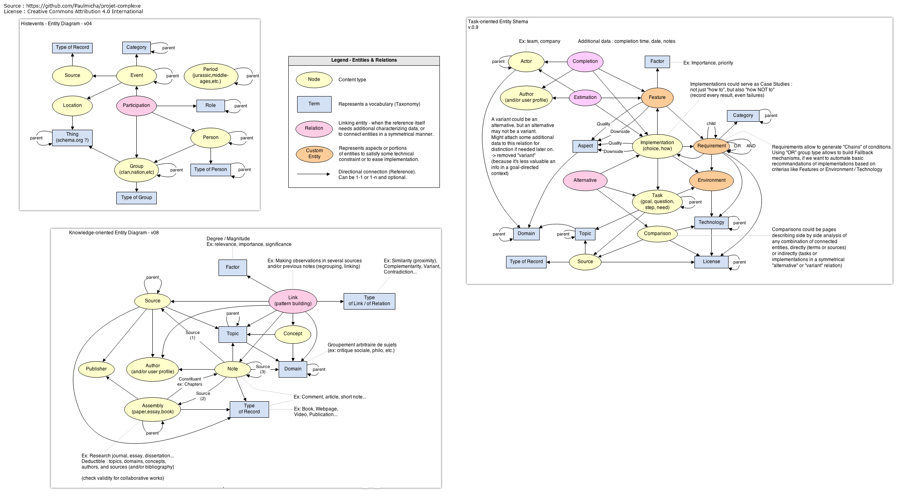

# Projet Complexe

## 2026 revival (~15 years later)

Same questions, clearer architecture.

What began between 2009 and 2014 as notes, research, and knowledge organization returns now as something more precise: a **semantic and visual environment** for tasks, knowledge, research, projects and agents — not another notes app, and not a system dashboard.

The old duality (task-oriented vs knowledge-oriented) was never just a UI idea. In 2026 it becomes a control principle for autonomous work: know enough to act, act until knowledge is missing, and stop researching when the task no longer justifies more inquiry.

### TL;DR (2026)

Projet Complexe is the interpretive layer:

- **Tasks** — what must happen?
- **Knowledge** — what is known (and what is not)?
- **Agents** — actors that move between the two
- **Projects / sources / research** — the semantic space humans and agents share

The desktop client is envisioned as **Tauri + SolidJS**. The UI technology is secondary. The essential claim is:

> **ASC is authoritative about execution. Projet Complexe is authoritative about interpretation.**

Anything the GUI can cause should remain reproducible from the terminal.

### Three projects

These are not three competing apps. They are three scopes:

```text
Projet Complexe          →  meaning, tasks, knowledge, research, agents, desktop UI
        ↓
Projet Complexe ASC      →  domain-specific pivots, compositions, integrations
        ↓
ASC                      →  generic computational vocabulary (names, pivots, execution)
```

| Project | Question | Role |
|---|---|---|
| **[ASC](https://github.com/Paulmicha/asc)** | What exists, and what can be done? | Generic substrate over the shell / filesystem / processes / machines |
| **Projet Complexe ASC** *(planned)* | Which ASC capabilities does *this* environment expose? | Thin bridge: entry points and compositions without contaminating ASC |
| **Projet Complexe** *(this repo)* | What am I trying to accomplish, what do I know, what does it mean? | Semantic + visual environment |

Rule of thumb: Projet Complexe should use ASC without becoming ASC-specific; Projet Complexe ASC should use ASC specifically without becoming a second ASC.

### First milestone

Not “the complete second brain”, nor “the complete agent framework”.

Demonstrate the architectural invariant:

> A useful operation can be represented as a stable ASC pivot, executed from the terminal, and consumed by Projet Complexe without the UI knowing its implementation.

### What this is not

- Not a Drupal revival
- Not a CPU / Docker / Solr status console (machines appear when they matter to a project or agent)
- Not ASC with a GUI bolted on
- Not stuffing second-brain ontology into ASC’s generic core

---

## Origins (2009–2014)

### TL;DR (then)

*"All [curation](https://twitter.com/plevy/status/716299155904311297) grows until it requires search. All search grows until it requires curation"* – [B. Evans](http://ben-evans.com/benedictevans/2016/1/31/lists-are-the-new-search)

This project gathered old ideas about an open-source web application for taking notes. Its functions / objectives were:

* Research journal on very diverse subjects (personal archive)
* Private, public, multi-user with optional open access for collaboration, inspiration, discourse
* Organizing notes (relations, knowledge management, "archeology of knowledge", reflexivity) - including experimenting with automation (e.g. producing suggestions or generating relations) and mixing different indexes
* Data import/export (including periodically) and visualization
* Efficient interface [design](https://principles.adactio.com/) aiming for accessibility, progressive enhancement, and offline capabilities (+ installable app ?)

### Conception

Between 2009 and 2014, I started several projects which are now integrated into a single one ("projet complexe"). One started out of curiosity for History and interactive visualization of historical events, another focused on the findability of "memos" about practical knowledge (consisting in a collection and archive of instructions, guides and tutorials), and the last one was centered around the organization of concepts and ideas (their origins, development and interactions).

[](docs/assets/projet-complexe-diagrams-v01.png)
Image above : combined architecture of past projects in the form of a simplified entity diagram, also representing Drupal-related entities.

### Design

The idea of merging different legacy projects - some of which having very different use cases - into a single one poses challenges for deciding how to approach the design of the interface. For now, I'm considering a conceptual categorization of the diverse contents available based on my own two main intentions to use this application : achieving tasks (getting things done), and learning (improving and extending knowledge).

How this duality translates into interface design choices is not very clear yet (i.e. selectable modes re-arranging the layout and/or functions available), but here's a list of terms illustrating this concept of "duality of use" when using the app to search :

Knowledge-oriented | Task-oriented
--- | ---
Problem | Solution
Exploration / Digression | Goal / Focus
Complexification | Simplification
Design (projection) / Concept | Execution / Implementation / Realization
Research / Reflection / Opinion | Decision
Analysis / Explanation | Directives / Tasks
Anticipation | Reaction / Adaptation
Theory | Practice
Information | Command
Thought | Action

In any context, I'm hoping to experiment with visualization ideas specific to current intent ("orientation").

That same duality returns in 2026 as a **mutual killswitch** for autonomous agents: a task can suspend itself when knowledge is missing; research can be stopped when the task imperative makes further inquiry unjustified. The semantic distinction was already here; the control-theoretic reading is new.

## License

Source code is [GPLv2](LICENSE).
All content is [Creative Commons Attribution 4.0 International](https://creativecommons.org/licenses/by/4.0/), unless otherwise stated.
