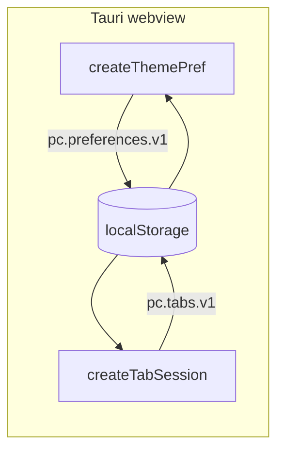

# Persist theme and tabs — implementation plan

> **For agentic workers:** REQUIRED SUB-SKILL: Use superpowers:subagent-driven-development (recommended) or superpowers:executing-plans to implement this plan task-by-task. Steps use checkbox (`- [ ]`) syntax for tracking.

- **Date:** 2026-08-18
- **Updated:** 2026-08-18 — implemented on branch `local-storage` (uncommitted; human review before commit)
- **Status:** implemented (pending human commit + manual `pnpm tauri dev` checklist)
- **Scope:** Tauri webview `localStorage` for theme + flat tab session restore in `app/`
- **Repo:** `/home/paul/Documents/projet-complexe/app` (own git work tree; not the home-dir repo)
- **Branch:** `local-storage` (from `ui-base-structure` / plan 17)
- **Prerequisite:** [17-ui-base-structure.md](17-ui-base-structure.md) — done on `ui-base-structure`; this slice lifts “in-memory only; reload resets”.
- **Related:**
  - [17-ui-base-structure.md](17-ui-base-structure.md) (flat tabs, Chouette inverted surface, last-tab guard)
  - [17-ui-design-ideas.md](../../../data/ideas/2026/08/17-ui-design-ideas.md) §4 (hash codec = active tab only; session of tabs = Solid state — **hash / Location out of this slice**)
  - Pattern: `/home/paul/Documents/research-journal/src/lib/stores/preferences.js` (hydrate + subscribe write)
  - SDD ledger: `.superpowers/sdd/18-local-storage/progress.md` (gitignored scratch)

## Execution record (2026-08-18)

| Task | Result |
|---|---|
| 1 Storage helper | Done — `src/lib/storage.ts` + tests |
| 2 Theme pref + CSS | Done — `createThemePref`, surface tokens; fix: JSON `null` → light |
| 3 Persist tabs | Done — `state.note`, `pc.tabs.v1`, seq; fix: reject duplicate ids |
| 4 Workspace + FOUC | Done — theme toggle, panel notes, `index.html` bootstrap |
| Tests | `pnpm test` — 8 files, **28/28** pass |
| Final review | Approve — no Critical/Important product defects |
| Commits | **None** (per human request — review then commit yourself) |

**Solid 2 RC adaptations** (not in original plan snippets, required by this codebase): `ownedWrite: true` on signals, two-arg `createEffect`, `flush()` after mutations in session/theme factories (same pattern as plan 17).

**Do not stage tsc emit:** `vite.config.js`, `vite.config.d.ts`, `tsconfig.tsbuildinfo`, `tsconfig.node.tsbuildinfo`.

**Human checklist still open:** run `pnpm tauri dev` — dark theme, open Goal 2+3, activate Goal 2, reload; confirm theme + tabs + notes + active id restore.

**Goal:** Persist light/dark theme and the open tab strip (including a dummy per-tab state object) across reloads via the Tauri webview’s `localStorage`.

**Architecture:** Same research-journal pattern: hydrate on factory create, write JSON on every change. Two versioned keys (`pc.preferences.v1`, `pc.tabs.v1`). Factories accept an injectable `Storage` so Vitest can use a Map-backed fake. Theme also applies `document.documentElement.dataset.theme` (plus a tiny `index.html` bootstrap to avoid FOUC). No Rust, no `tauri-plugin-store`.

**Tech Stack:** Tauri 2 webview `localStorage`, SolidJS 2.0 RC (`createSignal` / `createEffect`), Vitest + jsdom, existing Kobalte Button, pnpm.



## Global Constraints

- **Prerequisite:** `src/shell/tab-session.ts`, `src/shell/workspace.tsx`, `src/css/base/_tokens.css`, Vitest harness from 17 must already exist.
- Do **not** add TanStack, `@solidjs/router`, Solid Start, `tauri-plugin-store`, or any persist library.
- Do **not** implement mode switch, hash codec, nested tabs, address bar, hamburger, GNOME overview, `Location` type, or ASC IPC.
- Do **not** follow `prefers-color-scheme` in this slice. Default theme is **light**.
- Do **not** use Chouette homepage `--blue` for dark mode. Dark = grey-dark background + light text.
- Do **not** store search indexes, caches, or large blobs in `localStorage` (prefs + small tab snapshots only, ~KB).
- Leave `src-tauri` unchanged. No Rust changes.
- Always ≥1 tab. Last tab’s close control stays `disabled` (unchanged from 17).
- Solid 2: `jsxImportSource` is `@solidjs/web`. Tests use Vitest + jsdom + `createRoot` from `solid-js` (same as 17’s session tests). Do **not** add `@solidjs/testing-library`.
- Kobalte imports stay `from "@opencenter-cloud/kobalte-core/button"` (and tabs).
- `pnpm` only.

## Decisions locked (2026-08-18)

| Topic | Choice |
|---|---|
| Storage API | Webview `localStorage` (WebKitGTK on Debian). No plugin-store unless later proven flaky |
| Keys | Two versioned keys: `pc.preferences.v1`, `pc.tabs.v1` |
| Theme values | `"light" \| "dark"`. Default `light`. Corrupt / missing → default |
| Theme UX | Kobalte `Button` in the Cluster strip (right of `+`), not hamburger |
| Theme apply | `document.documentElement.dataset.theme` + `color-scheme`; FOUC bootstrap in `index.html` |
| Tab model | Extend 17’s `{ id, title }` with `state: { note: string }` (dummy until Location exists) |
| Tab snapshot | `{ v: 1, tabs, activeId, seq }` — persist `seq` so restored sessions do not reuse ids |
| Validation | Snapshot must have `v === 1`, ≥1 tab, `activeId` in list, numeric `seq` ≥ max numeric id; else default |
| Testability | Inject `Storage` into factories; production defaults to `localStorage` |
| Tests | Vitest + fake Storage. No Playwright / Tauri e2e |

## File map

**Create:**

- `src/lib/storage.ts`
- `src/lib/storage.test.ts`
- `src/shell/theme-pref.ts`
- `src/shell/theme-pref.test.ts`

**Modify:**

- `src/css/base/_tokens.css` — surface aliases + `[data-theme]` blocks
- `src/css/base/_root.css` — use `--surface-bg` / `--surface-text`
- `src/shell/tab-session.ts` — `state`, hydrate/persist, options
- `src/shell/tab-session.test.ts` — restore / corrupt / seq tests
- `src/shell/workspace.tsx` — theme toggle; show `tab.state.note`
- `src/shell/workspace.css` — toggle button spacing if needed
- `index.html` — inline theme bootstrap before Solid

**Do not touch:**

- `src-tauri/**`
- `data/ideas/**`
- layout primitives (`src/layouts/**`) except via tokens

---

### Task 1: Storage helper

**Files:**

- Create: `src/lib/storage.ts`, `src/lib/storage.test.ts`

**Interfaces:**

- Consumes: Web `Storage` (or a fake with the same methods)
- Produces:

```ts
export function readJson<T>(storage: Storage, key: string, fallback: T): T;
export function writeJson(storage: Storage, key: string, value: unknown): void;
```

Rules:

- `readJson`: missing key, empty string, invalid JSON, or thrown `getItem` → return `fallback` (do not throw).
- `writeJson`: `JSON.stringify` + `setItem`. Swallow `QuotaExceededError` and other `setItem` failures (prefs must not crash the UI).

- [x] **Step 1: Write `src/lib/storage.test.ts`** (failing)

```ts
import { expect, test } from "vitest";
import { readJson, writeJson } from "./storage";

function fakeStorage(): Storage {
  const map = new Map<string, string>();
  return {
    get length() {
      return map.size;
    },
    clear() {
      map.clear();
    },
    getItem(key: string) {
      return map.has(key) ? map.get(key)! : null;
    },
    key(index: number) {
      return [...map.keys()][index] ?? null;
    },
    removeItem(key: string) {
      map.delete(key);
    },
    setItem(key: string, value: string) {
      map.set(key, value);
    },
  };
}

test("readJson returns fallback when missing", () => {
  const s = fakeStorage();
  expect(readJson(s, "k", { a: 1 })).toEqual({ a: 1 });
});

test("readJson returns fallback on invalid JSON", () => {
  const s = fakeStorage();
  s.setItem("k", "{not-json");
  expect(readJson(s, "k", { a: 1 })).toEqual({ a: 1 });
});

test("writeJson round-trips", () => {
  const s = fakeStorage();
  writeJson(s, "k", { theme: "dark" });
  expect(readJson(s, "k", { theme: "light" })).toEqual({ theme: "dark" });
});
```

- [x] **Step 2: Run tests — expect FAIL**

```bash
cd /home/paul/Documents/projet-complexe/app
pnpm test src/lib/storage.test.ts
```

- [x] **Step 3: Implement `src/lib/storage.ts`**

```ts
export function readJson<T>(storage: Storage, key: string, fallback: T): T {
  try {
    const raw = storage.getItem(key);
    if (raw == null || raw.length === 0) return fallback;
    return JSON.parse(raw) as T;
  } catch {
    return fallback;
  }
}

export function writeJson(storage: Storage, key: string, value: unknown): void {
  try {
    storage.setItem(key, JSON.stringify(value));
  } catch {
    // QuotaExceeded or private-mode quirks — ignore
  }
}
```

- [x] **Step 4: Run tests — expect PASS**

```bash
pnpm test src/lib/storage.test.ts
```

- [x] **Step 5: Commit**

```bash
git add src/lib/storage.ts src/lib/storage.test.ts
git commit -m "$(cat <<'EOF'
Add localStorage JSON read/write helper with safe fallbacks.

EOF
)"
```

---

### Task 2: Theme preference + CSS

**Files:**

- Create: `src/shell/theme-pref.ts`, `src/shell/theme-pref.test.ts`
- Modify: `src/css/base/_tokens.css`, `src/css/base/_root.css`

**Interfaces:**

- Consumes: `readJson` / `writeJson`, injectable `Storage`
- Produces:

```ts
export type Theme = "light" | "dark";

export type ThemePref = {
  theme: () => Theme;
  setTheme: (theme: Theme) => void;
  toggle: () => void;
};

export type ThemePrefOptions = {
  storage?: Storage;
  /** defaults to document.documentElement when in browser */
  root?: HTMLElement;
};

export const PREFERENCES_KEY = "pc.preferences.v1";

export function createThemePref(options?: ThemePrefOptions): ThemePref;
```

Rules:

- Key `pc.preferences.v1` stores `{ theme: Theme }`.
- Default `light` when missing, corrupt, or `theme` is not `"light"` / `"dark"`.
- On create and on every change: write JSON; set `root.dataset.theme = theme`; set `root.style.colorScheme = theme`.
- `toggle()` flips light ↔ dark.
- Production: `storage` defaults to `localStorage`, `root` defaults to `document.documentElement`.
- Tests: pass fake `Storage` + a detached `document.createElement("html")` as `root`.

CSS:

- Introduce `--surface-bg` / `--surface-text`.
- `[data-theme="light"]` (and default `:root` without attribute, or treat missing as light): `--surface-bg: var(--inverted-bg-color)`; `--surface-text: var(--inverted-text-color)`.
- `[data-theme="dark"]`: `--surface-bg: var(--grey-dark)`; `--surface-text: white` (or equivalent light grey). Do **not** use `--blue`.
- `_root.css` body / `#root` uses `--surface-bg` / `--surface-text` instead of hard-coding inverted tokens.

- [x] **Step 1: Write `src/shell/theme-pref.test.ts`** (failing)

```ts
import { expect, test } from "vitest";
import { createRoot } from "solid-js";
import { createThemePref, PREFERENCES_KEY } from "./theme-pref";

function fakeStorage(): Storage {
  const map = new Map<string, string>();
  return {
    get length() {
      return map.size;
    },
    clear() {
      map.clear();
    },
    getItem(key: string) {
      return map.has(key) ? map.get(key)! : null;
    },
    key(index: number) {
      return [...map.keys()][index] ?? null;
    },
    removeItem(key: string) {
      map.delete(key);
    },
    setItem(key: string, value: string) {
      map.set(key, value);
    },
  };
}

test("defaults to light and writes preferences", () => {
  createRoot((dispose) => {
    const storage = fakeStorage();
    const root = document.createElement("html");
    const p = createThemePref({ storage, root });
    expect(p.theme()).toBe("light");
    expect(root.dataset.theme).toBe("light");
    expect(JSON.parse(storage.getItem(PREFERENCES_KEY)!)).toEqual({
      theme: "light",
    });
    dispose();
  });
});

test("hydrates dark from storage", () => {
  createRoot((dispose) => {
    const storage = fakeStorage();
    storage.setItem(PREFERENCES_KEY, JSON.stringify({ theme: "dark" }));
    const root = document.createElement("html");
    const p = createThemePref({ storage, root });
    expect(p.theme()).toBe("dark");
    expect(root.dataset.theme).toBe("dark");
    dispose();
  });
});

test("corrupt preferences fall back to light", () => {
  createRoot((dispose) => {
    const storage = fakeStorage();
    storage.setItem(PREFERENCES_KEY, "{bad");
    const root = document.createElement("html");
    const p = createThemePref({ storage, root });
    expect(p.theme()).toBe("light");
    dispose();
  });
});

test("toggle flips and persists", () => {
  createRoot((dispose) => {
    const storage = fakeStorage();
    const root = document.createElement("html");
    const p = createThemePref({ storage, root });
    p.toggle();
    expect(p.theme()).toBe("dark");
    expect(JSON.parse(storage.getItem(PREFERENCES_KEY)!).theme).toBe("dark");
    p.toggle();
    expect(p.theme()).toBe("light");
    dispose();
  });
});
```

- [x] **Step 2: Run tests — expect FAIL**

```bash
pnpm test src/shell/theme-pref.test.ts
```

- [x] **Step 3: Implement `src/shell/theme-pref.ts`**

```ts
import { createEffect, createSignal } from "solid-js";
import { readJson, writeJson } from "../lib/storage";

export type Theme = "light" | "dark";

export type ThemePref = {
  theme: () => Theme;
  setTheme: (theme: Theme) => void;
  toggle: () => void;
};

export type ThemePrefOptions = {
  storage?: Storage;
  root?: HTMLElement;
};

export const PREFERENCES_KEY = "pc.preferences.v1";

function isTheme(value: unknown): value is Theme {
  return value === "light" || value === "dark";
}

function applyTheme(root: HTMLElement, theme: Theme) {
  root.dataset.theme = theme;
  root.style.colorScheme = theme;
}

export function createThemePref(options?: ThemePrefOptions): ThemePref {
  const storage = options?.storage ?? localStorage;
  const root = options?.root ?? document.documentElement;

  const stored = readJson<{ theme?: unknown }>(storage, PREFERENCES_KEY, {});
  const initial: Theme = isTheme(stored.theme) ? stored.theme : "light";

  const [theme, setThemeSignal] = createSignal<Theme>(initial);

  const setTheme = (next: Theme) => {
    setThemeSignal(next);
  };

  const toggle = () => {
    setThemeSignal((t) => (t === "light" ? "dark" : "light"));
  };

  createEffect(() => {
    const t = theme();
    writeJson(storage, PREFERENCES_KEY, { theme: t });
    applyTheme(root, t);
  });

  return { theme, setTheme, toggle };
}
```

- [x] **Step 4: Update tokens / root CSS**

In `_tokens.css`, after inverted aliases, add:

```css
:root,
[data-theme="light"] {
  --surface-bg: var(--inverted-bg-color);
  --surface-text: var(--inverted-text-color);
}

[data-theme="dark"] {
  --surface-bg: var(--grey-dark);
  --surface-text: white;
}
```

In `_root.css`, set `html` / `body` / `#root` background and color to `var(--surface-bg)` and `var(--surface-text)` (replace direct inverted usage for the chrome surface).

- [x] **Step 5: Run tests — expect PASS**

```bash
pnpm test src/shell/theme-pref.test.ts
```

- [x] **Step 6: Commit**

```bash
git add src/shell/theme-pref.ts src/shell/theme-pref.test.ts src/css/base/_tokens.css src/css/base/_root.css
git commit -m "$(cat <<'EOF'
Add light/dark theme preference persisted in localStorage.

EOF
)"
```

---

### Task 3: Persist tab session (+ dummy state)

**Files:**

- Modify: `src/shell/tab-session.ts`, `src/shell/tab-session.test.ts`

**Interfaces:**

- Consumes: `readJson` / `writeJson`, injectable `Storage`
- Produces (extends 17):

```ts
export type TabState = {
  note: string;
};

export type Tab = {
  id: string;
  title: string;
  state: TabState;
};

export type TabSession = {
  tabs: () => Tab[];
  activeId: () => string;
  setActiveId: (id: string) => void;
  add: () => void;
  close: (id: string) => void;
};

export type TabSessionOptions = {
  storage?: Storage;
};

export const TABS_KEY = "pc.tabs.v1";

export type TabSnapshot = {
  v: 1;
  tabs: Tab[];
  activeId: string;
  seq: number;
};

export function createTabSession(options?: TabSessionOptions): TabSession;
```

Rules (keep 17 behavior, add persistence):

- Default when no/invalid snapshot: `tabs = [{ id: "1", title: "Goal 1", state: { note: "dummy:Goal 1" } }]`, `activeId = "1"`, `seq = 1`.
- `add()`: `seq += 1`, append `{ id: String(seq), title: \`Goal ${seq}\`, state: { note: \`dummy:Goal ${seq}\` } }`, activate new id.
- `close(id)`: no-op when length === 1; else remove; if closed was active, activate left neighbour (or new first).
- Persist snapshot on every change via `createEffect`: `{ v: 1, tabs: tabs(), activeId: activeId(), seq }`.
- Validate on hydrate:
  - `raw.v === 1`
  - `Array.isArray(raw.tabs)` and `raw.tabs.length >= 1`
  - every tab has string `id`, string `title`, and `state` object with string `note` (if `state`/`note` missing, coerce to `{ note: \`dummy:${title}\` }` only when the rest of the tab is valid — or reject whole snapshot; prefer **reject whole snapshot** for simplicity)
  - `typeof raw.activeId === "string"` and some tab has that id
  - `typeof raw.seq === "number"` and `Number.isFinite(raw.seq)` and `raw.seq >= max numeric id` among tabs (parse ids with `Number`; non-numeric ids fail validation)
  - else use default
- Production `storage` defaults to `localStorage`.

- [x] **Step 1: Extend `src/shell/tab-session.test.ts`**

Keep existing 17 tests, updating expectations to include `state`. Add:

```ts
import { TABS_KEY } from "./tab-session";

// reuse fakeStorage from Task 1/2 pattern (copy into this file or extract later — copy is fine)

test("add includes dummy state note", () => {
  createRoot((dispose) => {
    const s = createTabSession({ storage: fakeStorage() });
    s.add();
    expect(s.tabs()[1]).toEqual({
      id: "2",
      title: "Goal 2",
      state: { note: "dummy:Goal 2" },
    });
    dispose();
  });
});

test("second session hydrates tabs and activeId", () => {
  createRoot((dispose) => {
    const storage = fakeStorage();
    const a = createTabSession({ storage });
    a.add();
    a.add();
    a.setActiveId("2");
    const b = createTabSession({ storage });
    expect(b.tabs().map((t) => t.id)).toEqual(["1", "2", "3"]);
    expect(b.activeId()).toBe("2");
    expect(b.tabs()[2].state.note).toBe("dummy:Goal 3");
    dispose();
  });
});

test("corrupt snapshot falls back to Goal 1", () => {
  createRoot((dispose) => {
    const storage = fakeStorage();
    storage.setItem(TABS_KEY, "{bad");
    const s = createTabSession({ storage });
    expect(s.tabs()).toEqual([
      { id: "1", title: "Goal 1", state: { note: "dummy:Goal 1" } },
    ]);
    expect(s.activeId()).toBe("1");
    dispose();
  });
});

test("seq continues after restore so ids do not collide", () => {
  createRoot((dispose) => {
    const storage = fakeStorage();
    const a = createTabSession({ storage });
    a.add(); // Goal 2
    a.close("1"); // left with Goal 2 only, seq still 2
    const b = createTabSession({ storage });
    b.add();
    expect(b.tabs().map((t) => t.id)).toEqual(["2", "3"]);
    expect(b.tabs()[1].title).toBe("Goal 3");
    dispose();
  });
});

test("invalid activeId rejects snapshot", () => {
  createRoot((dispose) => {
    const storage = fakeStorage();
    storage.setItem(
      TABS_KEY,
      JSON.stringify({
        v: 1,
        tabs: [{ id: "1", title: "Goal 1", state: { note: "dummy:Goal 1" } }],
        activeId: "999",
        seq: 1,
      }),
    );
    const s = createTabSession({ storage });
    expect(s.activeId()).toBe("1");
    expect(s.tabs()).toHaveLength(1);
    dispose();
  });
});
```

Also update the original “starts with Goal 1” assertion to include `state: { note: "dummy:Goal 1" }`. Pass `{ storage: fakeStorage() }` in all tests so they do not touch real `localStorage`.

- [x] **Step 2: Run tests — expect FAIL**

```bash
pnpm test src/shell/tab-session.test.ts
```

- [x] **Step 3: Implement persistence in `src/shell/tab-session.ts`**

```ts
import { createEffect, createSignal } from "solid-js";
import { readJson, writeJson } from "../lib/storage";

export type TabState = { note: string };

export type Tab = {
  id: string;
  title: string;
  state: TabState;
};

export type TabSession = {
  tabs: () => Tab[];
  activeId: () => string;
  setActiveId: (id: string) => void;
  add: () => void;
  close: (id: string) => void;
};

export type TabSessionOptions = {
  storage?: Storage;
};

export const TABS_KEY = "pc.tabs.v1";

export type TabSnapshot = {
  v: 1;
  tabs: Tab[];
  activeId: string;
  seq: number;
};

function defaultTab(): Tab {
  return { id: "1", title: "Goal 1", state: { note: "dummy:Goal 1" } };
}

function isTab(value: unknown): value is Tab {
  if (value == null || typeof value !== "object") return false;
  const t = value as Record<string, unknown>;
  if (typeof t.id !== "string" || typeof t.title !== "string") return false;
  if (t.state == null || typeof t.state !== "object") return false;
  const state = t.state as Record<string, unknown>;
  return typeof state.note === "string";
}

function parseSnapshot(raw: unknown): TabSnapshot | null {
  if (raw == null || typeof raw !== "object") return null;
  const o = raw as Record<string, unknown>;
  if (o.v !== 1) return null;
  if (!Array.isArray(o.tabs) || o.tabs.length < 1) return null;
  if (!o.tabs.every(isTab)) return null;
  if (typeof o.activeId !== "string") return null;
  if (!o.tabs.some((t) => (t as Tab).id === o.activeId)) return null;
  if (typeof o.seq !== "number" || !Number.isFinite(o.seq)) return null;
  const maxId = Math.max(
    ...o.tabs.map((t) => {
      const n = Number((t as Tab).id);
      return Number.isFinite(n) ? n : NaN;
    }),
  );
  if (!Number.isFinite(maxId) || o.seq < maxId) return null;
  return {
    v: 1,
    tabs: o.tabs as Tab[],
    activeId: o.activeId,
    seq: o.seq,
  };
}

export function createTabSession(options?: TabSessionOptions): TabSession {
  const storage = options?.storage ?? localStorage;
  const parsed = parseSnapshot(readJson(storage, TABS_KEY, null));

  let seq = parsed?.seq ?? 1;
  const [tabs, setTabs] = createSignal<Tab[]>(
    parsed?.tabs ?? [defaultTab()],
  );
  const [activeId, setActiveId] = createSignal(parsed?.activeId ?? "1");

  const add = () => {
    seq += 1;
    const id = String(seq);
    const next: Tab = {
      id,
      title: `Goal ${seq}`,
      state: { note: `dummy:Goal ${seq}` },
    };
    setTabs((list) => [...list, next]);
    setActiveId(id);
  };

  const close = (id: string) => {
    const list = tabs();
    if (list.length <= 1) return;
    const index = list.findIndex((t) => t.id === id);
    if (index < 0) return;
    const remaining = list.filter((t) => t.id !== id);
    setTabs(remaining);
    if (activeId() === id) {
      const neighbour = remaining[Math.max(0, index - 1)];
      setActiveId(neighbour.id);
    }
  };

  createEffect(() => {
    const snapshot: TabSnapshot = {
      v: 1,
      tabs: tabs(),
      activeId: activeId(),
      seq,
    };
    writeJson(storage, TABS_KEY, snapshot);
  });

  return { tabs, activeId, setActiveId, add, close };
}
```

- [x] **Step 4: Run tests — expect PASS**

```bash
pnpm test src/shell/tab-session.test.ts
```

- [x] **Step 5: Commit**

```bash
git add src/shell/tab-session.ts src/shell/tab-session.test.ts
git commit -m "$(cat <<'EOF'
Persist tab session and dummy per-tab state in localStorage.

EOF
)"
```

---

### Task 4: Workspace theme toggle + FOUC bootstrap

**Files:**

- Modify: `src/shell/workspace.tsx`, `src/shell/workspace.css`, `index.html`

**Interfaces:**

- Consumes: `createThemePref`, `createTabSession` (no options → real `localStorage`), existing Cover / Stack / Cluster / Tabs / Button
- Produces: same `Workspace` export; chrome gains a theme toggle

Composition change (Cluster row):

```text
Cluster
  Tabs.Root …
    Tabs.List
      tab items…
      Button +          ← existing
      Button theme      ← NEW: aria-label "Toggle theme", shows Light/Dark based on theme()
  Tabs.Content…
    panel: title + state.note
```

FOUC: in `index.html`, before the Vite module script, add a tiny inline script that:

1. `try`s `JSON.parse(localStorage.getItem("pc.preferences.v1"))`
2. if `theme` is `"light"` or `"dark"`, sets `document.documentElement.dataset.theme` and `document.documentElement.style.colorScheme`
3. otherwise leaves default (CSS treats missing / light the same)

Do **not** import Solid here. Keep the script under ~10 lines.

- [x] **Step 1: Update panel markup in `workspace.tsx`**

Inside each `Tabs.Content` / `.panel`, show both title and note:

```tsx
<div class="panel">
  <p>{tab.title}</p>
  <p class="panel-note">{tab.state.note}</p>
</div>
```

- [x] **Step 2: Wire theme pref + toggle**

```tsx
import { createThemePref } from "./theme-pref";

// inside Workspace:
const session = createTabSession();
const prefs = createThemePref();

// in Cluster, after the add Button:
<Button
  aria-label="Toggle theme"
  onClick={() => prefs.toggle()}
>
  {prefs.theme() === "light" ? "Dark" : "Light"}
</Button>
```

Button label = the theme you switch **to** (common pattern). Keep close-as-sibling rule from 17.

- [x] **Step 3: Add FOUC script to `index.html`**

Place immediately before `<script type="module" src="/src/index.tsx"></script>`:

```html
<script>
  try {
    var raw = localStorage.getItem("pc.preferences.v1");
    var theme = raw && JSON.parse(raw).theme;
    if (theme === "light" || theme === "dark") {
      document.documentElement.dataset.theme = theme;
      document.documentElement.style.colorScheme = theme;
    }
  } catch (e) {}
</script>
```

- [x] **Step 4: CSS polish**

If the Cluster packs too tightly, add a small gap utility already provided by Cluster `space` prop (prefer prop over ad-hoc margin). Optional `.panel-note { opacity: 0.75; }` using existing tokens only.

- [x] **Step 5: Automated tests still green**

```bash
pnpm test
```

Expected: all storage / theme / tab-session / layout tests PASS.

- [x] **Step 6: Manual verification**

```bash
pnpm tauri dev
```

Checklist:

1. App opens in **light** theme (or restored dark if already set).
2. Click theme toggle → surface flips to dark (grey-dark / white text), no blue flash.
3. Open Goal 2 and Goal 3; activate Goal 2; note each panel shows `dummy:Goal N`.
4. Reload the window (or restart `tauri dev` without clearing webview data).
5. Theme is still dark; tabs Goal 1–3 restored; active is Goal 2; notes still visible.
6. Close until one tab remains — close control disabled; reload still has ≥1 tab.
7. Corrupt test (optional, DevTools): set `localStorage.setItem("pc.tabs.v1", "{")` then reload → falls back to Goal 1.

- [x] **Step 7: Commit**

```bash
git add src/shell/workspace.tsx src/shell/workspace.css index.html
git commit -m "$(cat <<'EOF'
Wire theme toggle and FOUC bootstrap; show restored tab notes.

EOF
)"
```

---

## Out of scope (already designed elsewhere)

Leave these in [17-ui-design-ideas.md](../../../data/ideas/2026/08/17-ui-design-ideas.md) until a later changelog:

- hash codec / `Location` / mode as the real per-tab state (replace dummy `{ note }`)
- nested tabs / book groups
- GNOME-style overview
- address bar over ASC pivots
- `prefers-color-scheme` auto theme
- `tauri-plugin-store` (only if WebKitGTK `localStorage` proves flaky on Debian)
- syncing preferences to ASC / disk outside the webview data dir

## Safety notes

- Keys hold UI prefs only (theme enum + small tab list). Do not grow `state` into document caches.
- Changing Tauri `useHttpsScheme` between releases relocates webview storage (origin change) — call out in a future release note if that config flips.
- Uninstall / wiping the webview data directory drops both keys.

## Spec coverage (self-review)

| Requirement | Task |
|---|---|
| Theme light/dark save + restore | 2, 4 |
| Default light; corrupt → default | 2 |
| No Chouette blue in dark | 2 (CSS) |
| FOUC-safe theme on load | 2, 4 |
| Restore last opened tabs | 3, 4 |
| Dummy per-tab state object | 3, 4 |
| Persist seq / no id collision | 3 |
| Invalid snapshot → Goal 1 | 3 |
| Injectable Storage for tests | 1–3 |
| No Rust / no plugin-store / no hash | constraints |
| Last-tab guard preserved | 3, 4 |

## Placeholder scan

None of TBD / “handle edge cases” / “write tests later”. Dummy `state.note` is intentional until the Location codec lands.

## Open tasks (after this slice)

- **Manual:** `pnpm tauri dev` reload checklist (theme, tabs, active Goal 2, notes) — agent could not verify GUI.
- Replace `TabState` with a real coordinate / view stub when the hash codec is planned.
- Revisit `tauri-plugin-store` only after a confirmed WebKitGTK persistence bug on this Debian stack.
- Optional follow-ups (do not block commit): explicit storage failure-path tests; Workspace integration tests for theme/FOUC/note; clear `localStorage` in `workspace.test.tsx` to avoid restore flakes.

---

**Implementation finished 2026-08-18** on branch `local-storage`, working tree uncommitted. Human reviews, runs the Tauri checklist, then commits.
